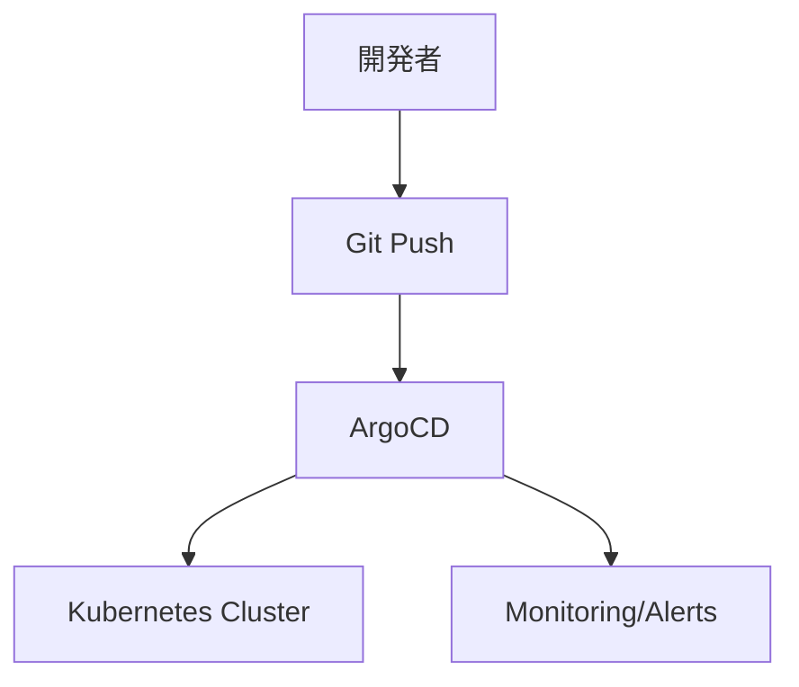
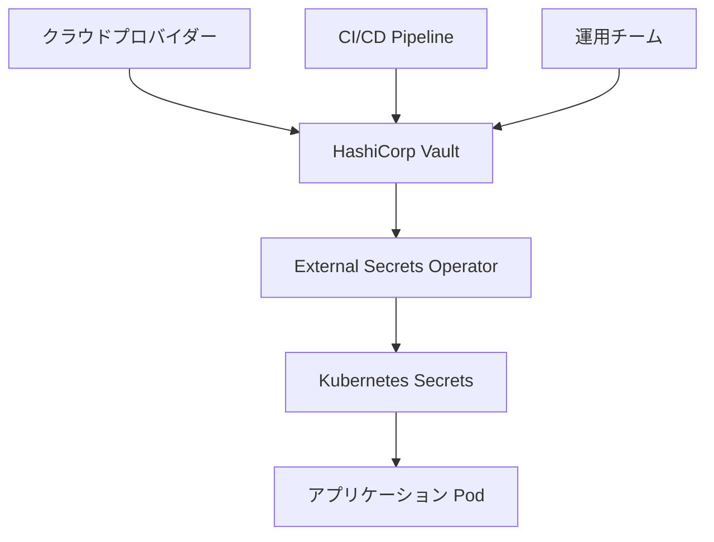
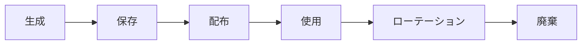

# 本番環境への展開とシークレット管理

## 本番環境デプロイメント戦略

### 1. GitOps アプローチ



### 2. 環境分離

- **Development**: `dev` ブランチ → 開発クラスター
- **Staging**: `staging` ブランチ → ステージングクラスター  
- **Production**: `main` ブランチ → 本番クラスター

### 3. プロモーション戦略

```bash
# 開発 → ステージング
git checkout staging
git merge dev
git push origin staging

# ステージング → 本番（プルリクエスト経由）
# レビュー・承認後のマージ
```

## シークレット管理アーキテクチャ

### 概要

Heraclesでは **Vault + External Secrets Operator** を使用したシークレット管理を実装：



### コンポーネント

#### 1. HashiCorp Vault

- **高可用性構成**: 3レプリカのHA構成
- **TLS暗号化**: 内部/外部通信の暗号化
- **認証方式**: Kubernetes Service Account認証
- **秘匿データ**: パスワード、APIキー、証明書

#### 2. External Secrets Operator

- **自動同期**: Vaultから1時間毎に秘匿情報を同期
- **テンプレート機能**: 動的なSecret生成
- **マルチクラスター対応**: ClusterSecretStore使用

#### 3. 管理対象シークレット

```yaml
# 例: データベース認証情報
apiVersion: external-secrets.io/v1beta1
kind: ExternalSecret
metadata:
  name: postgres-credentials
spec:
  refreshInterval: 1h
  secretStoreRef:
    name: vault-cluster-backend
    kind: ClusterSecretStore
  target:
    name: postgres-credentials
    template:
      data:
        username: "{{ .username }}"
        password: "{{ .password }}"
  data:
    - secretKey: username
      remoteRef:
        key: postgres/main
        property: username
```

## セキュリティベストプラクティス

### 1. ゼロトラスト原則

- **最小権限**: 必要最小限のアクセス権限
- **相互認証**: すべてのコンポーネント間でmTLS
- **監査ログ**: 全アクセスの記録・監視

### 2. 秘匿情報のライフサイクル



### 3. アクセス制御

- **Vault Policies**: 細粒度のアクセス制御
- **RBAC**: Kubernetes Role-Based Access Control
- **Network Policies**: ネットワークレベルの分離

## 本番環境固有の設定

### 1. 高可用性

```yaml
# Vault HA設定例
ha:
  enabled: true
  replicas: 3
  
# データベースクラスター
postgresql:
  replicaCount: 3
  
# Redis クラスター
redis:
  cluster:
    enabled: true
    slaveCount: 2
```

### 2. 永続化ストレージ

- **CSI Driver**: 各クラウドプロバイダーのCSI
- **バックアップ**: 自動スナップショット
- **暗号化**: 保存時暗号化（AES-256）

### 3. 監視・アラート

```yaml
# Prometheus アラートルール例
groups:
- name: vault.rules
  rules:
  - alert: VaultDown
    expr: up{job="vault"} == 0
    for: 5m
    annotations:
      summary: "Vault is down"
      
  - alert: ExternalSecretsFailure
    expr: external_secrets_sync_calls_error > 0
    for: 2m
```

## デプロイメント手順

### 1. 事前準備

#### 依存関係のインストール

```bash
# Prometheus Operator CRDsの事前インストール（必須）
kubectl apply -f https://raw.githubusercontent.com/prometheus-operator/prometheus-operator/main/example/prometheus-operator-crd/monitoring.coreos.com_servicemonitors.yaml
kubectl apply -f https://raw.githubusercontent.com/prometheus-operator/prometheus-operator/main/example/prometheus-operator-crd/monitoring.coreos.com_prometheusrules.yaml
kubectl apply -f https://raw.githubusercontent.com/prometheus-operator/prometheus-operator/main/example/prometheus-operator-crd/monitoring.coreos.com_podmonitors.yaml

# ArgoCD初期インストール
kubectl create namespace argocd
kubectl apply -n argocd -f https://raw.githubusercontent.com/argoproj/argo-cd/stable/manifests/install.yaml
kubectl wait --for=condition=Ready pods --all -n argocd --timeout=300s
```

#### Vault設定

```bash
# Vault初期化・アンシール
kubectl exec vault-0 -- vault operator init
kubectl exec vault-0 -- vault operator unseal

# 認証設定
kubectl exec vault-0 -- vault auth enable kubernetes
kubectl exec vault-0 -- vault write auth/kubernetes/config \
    token_reviewer_jwt="$(kubectl get secret --output=jsonpath='{.data.token}' vault-auth-secret | base64 -d)" \
    kubernetes_host=https://kubernetes.default.svc:443 \
    kubernetes_ca_cert=@/var/run/secrets/kubernetes.io/serviceaccount/ca.crt
```

### 2. シークレット投入

```bash
# 初期シークレットをVaultに保存
vault kv put secret/postgres/main username=postgres password=secure-password
vault kv put secret/redis/main password=redis-password
vault kv put secret/harbor/main admin-password=harbor-admin secret-key=harbor-secret
```

### 3. ArgoCD設定

```bash
# ArgoCD CLIログイン
argocd login localhost:8080 --username admin --password $(kubectl -n argocd get secret argocd-initial-admin-secret -o jsonpath='{.data.password}' | base64 -d)

# プライベートリポジトリの認証情報
argocd repo add https://github.com/ryone9re/heracles \
    --username git-user \
    --password git-token \
    --name heracles-repo

# Bootstrap Application（App of Apps パターン）の適用
kubectl apply -f gitops/argocd/app-of-apps.yaml
```

## 災害復旧・バックアップ

### 1. Vaultバックアップ

```bash
# スナップショット作成
vault operator raft snapshot save backup.snap

# 復元
vault operator raft snapshot restore backup.snap
```

### 2. データベースバックアップ

- **自動バックアップ**: S3/GCS等への定期バックアップ
- **ポイントインタイム復旧**: WAL-G使用
- **クロスリージョン複製**: 異なるリージョンへのレプリケーション

## 環境別設定例

### Development/Local

- シングルレプリカ
- ローカルストレージ (minikube標準)
- 簡略化されたTLS設定
- リソース制限: CPU 2コア、メモリ 4GB
- ストレージ: 20GB
- 自動デプロイ: `./deploy-local.sh`

### Staging

- 本番同等のHA構成
- 本番データのマスキング版使用
- 全機能のテスト環境
- リソース制限: CPU 4コア、メモリ 8GB
- ストレージ: 50GB

### Production

- フル冗長化構成
- 暗号化ストレージ
- 24/7監視・アラート
- 定期バックアップ
- コンプライアンス対応
- リソース制限: 無料枠範囲内での最大構成

## セキュリティ監査

### 1. 定期チェック項目

- [ ] 未使用のシークレットの特定・削除
- [ ] パスワードポリシーの遵守確認
- [ ] アクセスログの監査
- [ ] 脆弱性スキャン

### 2. コンプライアンス

- **SOC 2**: システム制御の監査
- **ISO 27001**: 情報セキュリティマネジメント
- **GDPR**: 個人データ保護規則対応

## トラブルシューティング

### よくある問題

1. **ArgoCD ApplicationのSyncエラー**
   - Prometheus CRDの事前インストール確認
   - リポジトリアクセス権限の確認
   - YAML構文エラーの確認
   ```bash
   kubectl describe application <app-name> -n argocd
   ```

2. **External Secrets同期失敗**
   - Vault認証の確認
   - ネットワーク接続の確認
   - ポリシー設定の確認

3. **Vault Unseal失敗**
   - キーシェアの確認
   - ストレージ接続の確認

4. **シークレット更新の遅延**
   - refreshInterval設定の確認
   - Operator のリソース制限確認

5. **リソース不足エラー**
   - ノードリソース使用量の確認
   ```bash
   kubectl top nodes
   kubectl describe nodes
   ```

6. **Pod起動失敗（ContainerCreating状態）**
   - イメージプルエラーの確認
   - ストレージ不足の確認
   - ネットワークポリシーの確認
   ```bash
   kubectl describe pod <pod-name> -n <namespace>
   ```

## 運用コマンド集

### 日常運用コマンド

```bash
# クラスター全体の状態確認
kubectl get nodes,pods --all-namespaces

# ArgoCD管理下のアプリケーション状態確認
kubectl get applications -n argocd

# シークレット同期状態確認
kubectl get externalsecrets --all-namespaces

# Vault状態確認
kubectl exec -n vault vault-0 -- vault status

# メトリクス確認
kubectl top nodes
kubectl top pods --all-namespaces
```

### 緊急時対応コマンド

```bash
# アプリケーション手動同期
kubectl patch application <app-name> -n argocd -p '{"operation":{"sync":{}}}' --type merge

# シークレット強制更新
kubectl annotate externalsecret <secret-name> -n <namespace> force-sync="$(date +%s)"

# Pod強制再起動
kubectl rollout restart deployment <deployment-name> -n <namespace>

# ログ確認
kubectl logs -f deployment/<deployment-name> -n <namespace>
```
