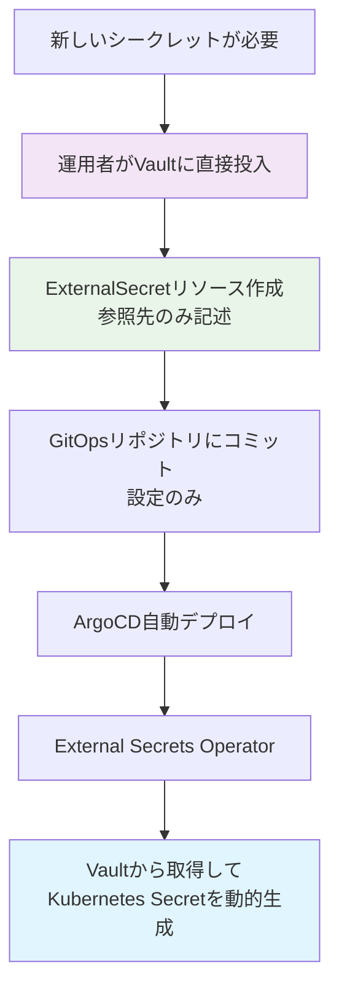

# 秘匿情報追加・管理ガイド

## 重要：セキュリティ原則

⚠️ 絶対にGitリポジトリに実際の秘匿情報を保存しないでください

- ✅ ExternalSecretには**参照先**のみ記述
- ✅ 実際の秘匿情報は**Vault**に直接保存
- ❌ パスワードやAPIキーをコードに埋め込まない

## 秘匿情報追加の流れ



## 1. Vaultへの秘匿情報追加

### ⚠️ 重要：運用者のみが実行

以下の操作は**運用者が直接Vaultに接続**して実行します。
**開発者のワークステーションやCI/CDパイプラインでは実行しません。**

```bash
# 新しいAPIキーを追加（運用者がVaultに直接接続）
vault kv put secret/external-api/service-x \
    api-key="your-secret-api-key" \
    webhook-secret="webhook-secret-value"

# PostgreSQL認証情報を追加（運用者がVaultに直接接続）
vault kv put secret/postgres/production \
    username="postgres-user" \
    password="$(openssl rand -base64 32)" \
    host="postgres.example.com" \
    database="production_db"

# TLS証明書を追加（運用者がVaultに直接接続）
vault kv put secret/tls/api-service \
    tls.crt="$(cat api-service.crt)" \
    tls.key="$(cat api-service.key)"
```

### 複雑な構造の保存

```bash
# OAuth認証情報（運用者がVaultに直接投入）
vault kv put secret/oauth/github \
    client-id="github-client-id" \
    client-secret="github-client-secret" \
    webhook-secret="github-webhook-secret" \
    private-key="$(cat github-app-private-key.pem)"

# PostgreSQL接続プール設定
vault kv put secret/postgres/pool-config \
    max-connections="20" \
    idle-timeout="300s" \
    connection-lifetime="3600s"
```

## 2. Vaultポリシーの設定

新しいシークレットには適切なアクセスポリシーを設定：

```bash
# ポリシーファイルを作成
cat > external-api-policy.hcl << EOF
path "secret/data/external-api/*" {
  capabilities = ["read"]
}
EOF

# Vaultにポリシーを適用
vault policy write external-api-read external-api-policy.hcl

# Service Accountにポリシーをバインド
vault write auth/kubernetes/role/external-api-reader \
    bound_service_account_names=external-secrets \
    bound_service_account_namespaces=external-secrets-system \
    policies=external-api-read \
    ttl=1h
```

## 3. ExternalSecretリソースの作成

### ✅ 安全：設定のみリポジトリにコミット

以下のYAMLファイルは**設定情報のみ**で、実際の秘匿情報は含まれません。
安全にGitリポジトリにコミットできます。

```yaml
# gitops/secrets/external-api-secrets.yaml
# ✅ 安全：参照先のみ記述、実際の値はVaultに保存
apiVersion: external-secrets.io/v1beta1
kind: ExternalSecret
metadata:
  name: external-api-credentials
  namespace: api-service
spec:
  refreshInterval: 15m  # 15分毎に同期
  secretStoreRef:
    name: vault-cluster-backend
    kind: ClusterSecretStore
  target:
    name: external-api-secret
    creationPolicy: Owner
    template:
      type: Opaque
      data:
        api-key: "{{ .apiKey }}"        # ← テンプレート変数
        webhook-secret: "{{ .webhookSecret }}"  # ← テンプレート変数
  data:
    - secretKey: apiKey
      remoteRef:
        key: external-api/service-x    # ← Vault内のパス（参照のみ）
        property: api-key              # ← プロパティ名（参照のみ）
    - secretKey: webhookSecret
      remoteRef:
        key: external-api/service-x    # ← Vault内のパス（参照のみ）
        property: webhook-secret       # ← プロパティ名（参照のみ）
```

### 高度なテンプレート機能

```yaml
# gitops/secrets/postgres-config.yaml
# ✅ 安全：PostgreSQL接続設定（参照のみ）
apiVersion: external-secrets.io/v1beta1
kind: ExternalSecret
metadata:
  name: postgres-config
  namespace: application
spec:
  refreshInterval: 1h
  secretStoreRef:
    name: vault-cluster-backend
    kind: ClusterSecretStore
  target:
    name: postgres-config
    template:
      type: Opaque
      data:
        # PostgreSQL接続文字列を動的生成
        database-url: "postgresql://{{ .username }}:{{ .password }}@{{ .host }}:5432/{{ .database }}"
        # 設定ファイル形式
        config.yaml: |
          database:
            host: "{{ .host }}"
            port: 5432
            username: "{{ .username }}"
            password: "{{ .password }}"
            database: "{{ .database }}"
            sslmode: require
            max_connections: {{ .maxConnections }}
  data:
    - secretKey: username
      remoteRef:
        key: postgres/production       # ← Vault内のパス
        property: username
    - secretKey: password
      remoteRef:
        key: postgres/production       # ← Vault内のパス
        property: password
    - secretKey: host
      remoteRef:
        key: postgres/production       # ← Vault内のパス
        property: host
    - secretKey: database
      remoteRef:
        key: postgres/production       # ← Vault内のパス
        property: database
    - secretKey: maxConnections
      remoteRef:
        key: postgres/pool-config      # ← Vault内のパス
        property: max-connections
```

## 4. Kustomizationへの追加

```yaml
# gitops/secrets/kustomization.yaml
# ✅ 安全：設定ファイルのリストのみ
apiVersion: kustomize.config.k8s.io/v1beta1
kind: Kustomization

resources:
  - external-secrets-operator.yaml
  - vault-secret-store.yaml
  - external-secrets.yaml
  - external-api-secrets.yaml    # 新規追加（参照設定のみ）
  - postgres-config.yaml         # 新規追加（参照設定のみ）
```

## 5. アプリケーションでの利用

### Environment Variables

```yaml
# アプリケーションPod定義
apiVersion: apps/v1
kind: Deployment
metadata:
  name: api-service
spec:
  template:
    spec:
      containers:
      - name: api-service
        image: api-service:latest
        env:
        - name: API_KEY
          valueFrom:
            secretKeyRef:
              name: external-api-secret
              key: api-key
        - name: DATABASE_URL
          valueFrom:
            secretKeyRef:
              name: postgres-config
              key: database-url
```

### Volume Mount

```yaml
# 設定ファイルとしてマウント
apiVersion: apps/v1
kind: Deployment
metadata:
  name: api-service
spec:
  template:
    spec:
      containers:
      - name: api-service
        image: api-service:latest
        volumeMounts:
        - name: postgres-config
          mountPath: /etc/config
          readOnly: true
        - name: tls-certs
          mountPath: /etc/ssl/certs
          readOnly: true
      volumes:
      - name: postgres-config
        secret:
          secretName: postgres-config
          items:
          - key: config.yaml
            path: postgres.yaml
      - name: tls-certs
        secret:
          secretName: tls-secret
```

## 6. セキュリティベストプラクティス

### パスワード生成とローテーション

```bash
# 強力なパスワード生成
openssl rand -base64 32

# 定期的なローテーション用スクリプト
#!/bin/bash
NEW_PASSWORD=$(openssl rand -base64 32)
vault kv patch secret/postgres/production password="$NEW_PASSWORD"

# アプリケーションの再起動（新しいパスワードを取得）
kubectl rollout restart deployment/api-service -n application
```

### アクセス監査

```bash
# Vaultアクセスログの確認
vault audit list
vault audit enable file file_path=/vault/logs/audit.log

# 特定のパスへのアクセス履歴
vault read sys/leases/lookup/secret/data/postgres/production
```

## 7. 環境別管理

### 環境固有のシークレット

```bash
# 開発環境（運用者がVaultに直接投入）
vault kv put secret/postgres/development \
    username="dev-user" \
    password="dev-password" \
    host="postgres-dev.example.com" \
    database="development_db"

# ステージング環境（運用者がVaultに直接投入）
vault kv put secret/postgres/staging \
    username="staging-user" \
    password="$(openssl rand -base64 32)" \
    host="postgres-staging.example.com" \
    database="staging_db"

# 本番環境（運用者がVaultに直接投入）
vault kv put secret/postgres/production \
    username="prod-user" \
    password="$(openssl rand -base64 32)" \
    host="postgres-prod.example.com" \
    database="production_db"
```

### 環境別ExternalSecret

```yaml
# gitops/secrets/environments/dev/postgres-config.yaml
# ✅ 安全：開発環境用PostgreSQL設定（参照のみ）
apiVersion: external-secrets.io/v1beta1
kind: ExternalSecret
metadata:
  name: postgres-config
  namespace: application
spec:
  data:
    - secretKey: username
      remoteRef:
        key: postgres/development  # 環境別のパス
        property: username
    - secretKey: database
      remoteRef:
        key: postgres/development
        property: database
```

## 8. トラブルシューティング

### 同期状態の確認

```bash
# ExternalSecretの状態確認
kubectl get externalsecrets -A
kubectl describe externalsecret external-api-credentials -n api-service

# 生成されたSecretの確認
kubectl get secret external-api-secret -n api-service -o yaml

# External Secrets Operatorのログ
kubectl logs -n external-secrets-system -l app.kubernetes.io/name=external-secrets
```

### よくあるエラーと対処法

```bash
# 1. Vault接続エラー
kubectl exec -n external-secrets-system deployment/external-secrets -- \
    wget -qO- http://vault.vault.svc.cluster.local:8200/v1/sys/health

# 2. 認証エラー
kubectl get secret vault-auth-secret -n external-secrets-system -o yaml

# 3. ポリシーエラー
vault policy read external-api-read
```

## 9. 自動化スクリプト例

### 新しいサービス用シークレット追加スクリプト

```bash
#!/bin/bash
# add-service-secret.sh
# ⚠️ 運用者のみが実行

SERVICE_NAME=$1
NAMESPACE=$2
API_KEY=$3

if [ -z "$SERVICE_NAME" ] || [ -z "$NAMESPACE" ] || [ -z "$API_KEY" ]; then
    echo "Usage: $0 <service-name> <namespace> <api-key>"
    exit 1
fi

echo "⚠️  運用者のみが実行してください"
echo "📍 VaultにAPIキーを直接投入します（Gitリポジトリには保存されません）"

# 1. Vaultにシークレット追加（運用者が直接実行）
vault kv put secret/services/$SERVICE_NAME \
    api-key="$API_KEY" \
    created-at="$(date -u +%Y-%m-%dT%H:%M:%SZ)"

# 2. ExternalSecretリソース生成
cat > gitops/secrets/${SERVICE_NAME}-secret.yaml << EOF
apiVersion: external-secrets.io/v1beta1
kind: ExternalSecret
metadata:
  name: ${SERVICE_NAME}-credentials
  namespace: $NAMESPACE
spec:
  refreshInterval: 15m
  secretStoreRef:
    name: vault-cluster-backend
    kind: ClusterSecretStore
  target:
    name: ${SERVICE_NAME}-secret
    creationPolicy: Owner
  data:
    - secretKey: api-key
      remoteRef:
        key: services/$SERVICE_NAME
        property: api-key
EOF

# 3. Kustomizationに追加
echo "  - ${SERVICE_NAME}-secret.yaml" >> gitops/secrets/kustomization.yaml

echo "✅ Secret configuration created for $SERVICE_NAME"
echo "📝 Next steps:"
echo "   1. Review gitops/secrets/${SERVICE_NAME}-secret.yaml (参照設定のみ)"
echo "   2. Commit and push to Git repository (実際の秘匿値は含まれません)"
echo "   3. ArgoCD will automatically deploy the changes"
echo ""
echo "🔒 セキュリティ確認:"
echo "   ✅ 実際のAPIキーはVaultに安全に保存されました"
echo "   ✅ Gitリポジトリには参照情報のみが保存されます"
```

## 10. 本番運用チェックリスト

### デプロイ前チェック

- [ ] Vaultポリシーが最小権限になっている
- [ ] シークレットの有効期限が適切に設定されている
- [ ] 環境別の設定が正しく分離されている
- [ ] バックアップが設定されている
- [ ] 監視・アラートが設定されている

### 定期メンテナンス

- [ ] 未使用シークレットの削除
- [ ] パスワードローテーション実行
- [ ] アクセスログの監査
- [ ] 脆弱性スキャン実行
- [ ] バックアップの復旧テスト
