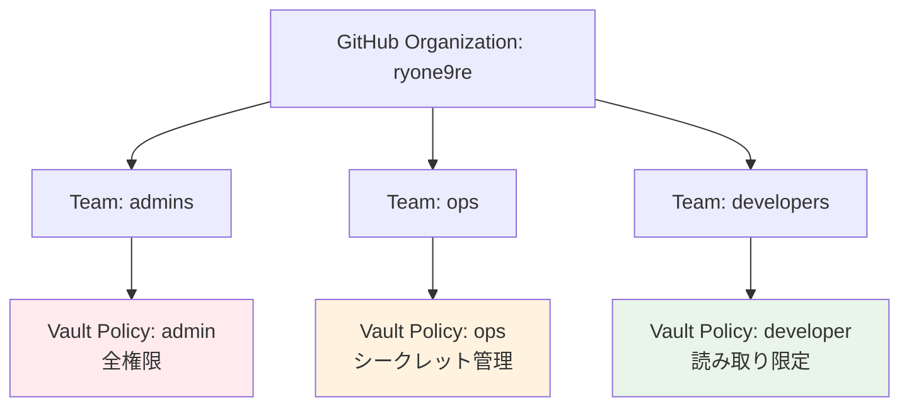

# Vault GitHub認証設定ガイド

## 概要

VaultでGitHubアカウントを使用してログインできるようにする設定手順です。
これにより、Vault UIからGitHubアカウントで簡単にログイン・秘匿情報の管理ができます。

## 1. GitHub OAuth Appの作成

### GitHub側での設定

1. **GitHub Settings** → **Developer settings** → **OAuth Apps** → **New OAuth App**

2. **Application details**:

   ```plaintext
   Application name: Heracles Vault
   Homepage URL: https://vault.ryone.dev
   Authorization callback URL: https://vault.ryone.dev/ui/vault/auth/github/oidc/callback
   ```

3. **Client ID** と **Client Secret** をメモ

## 2. Vaultにシークレット追加

### 運用者がVaultに直接投入

```bash
# GitHub OAuth App認証情報をVaultに保存
vault kv put secret/github/oauth-app \
    client-id="your-github-client-id" \
    client-secret="your-github-client-secret"
```

⚠️ **重要**: この操作は運用者が直接Vaultに接続して実行してください。

## 3. GitHubチーム・権限マッピング

### 推奨チーム構成



### 権限レベル

#### 🔴 Admin (admins team)

- **対象**: システム管理者
- **権限**: Vault全体の設定・管理
- **操作**: 全てのシークレット、認証方式、ポリシー管理

#### 🟡 Ops (ops team)

- **対象**: インフラ・運用チーム
- **権限**: シークレット管理
- **操作**: 本番環境シークレットの作成・更新・削除

#### 🟢 Developer (developers team)

- **対象**: 開発者
- **権限**: 読み取り限定
- **操作**: 開発・ステージング環境の参照、一部更新

## 4. デプロイ手順

### ExternalSecretの設定をリポジトリに追加

```bash
# Kustomizationに追加
echo "  - vault-github-auth.yaml" >> gitops/secrets/kustomization.yaml

# コミット・プッシュ
git add gitops/secrets/vault-github-auth.yaml
git add gitops/secrets/kustomization.yaml
git commit -m "Add GitHub authentication for Vault"
git push origin main
```

### GitHub認証の有効化

```bash
# VaultでGitHub認証設定ジョブを実行
kubectl apply -f gitops/secrets/vault-github-auth.yaml

# ジョブの実行状況確認
kubectl get jobs -n vault
kubectl logs -n vault job/vault-github-setup
```

## 5. ログイン方法

### Vault UI でのGitHubログイン

1. **Vault UI** にアクセス: `https://vault.ryone.dev`

2. **Method** を `GitHub` に選択

3. **GitHub Login** ボタンをクリック

4. **GitHub OAuth認証** でログイン承認

5. **Vault UI** で秘匿情報管理が可能

### CLI でのGitHubログイン

```bash
# GitHub tokenでログイン
export GITHUB_TOKEN="your-github-personal-access-token"
vault auth -method=github token="$GITHUB_TOKEN"

# または対話的ログイン
vault auth -method=github
```

## 6. 秘匿情報の追加フロー

### UI での追加（推奨）

1. Vault UI → GitHub でログイン
2. Secrets → secret/ → Create secret
3. Path: postgres/production
4. Key-Value pairs:
   - username: postgres-user
   - password: [生成されたパスワード]
   - host: postgres.example.com
   - database: production_db
5. Save

### 権限による操作制限

| チーム | 本番シークレット | ステージング | 開発環境 | Vault設定 |
|--------|------------------|--------------|----------|-----------|
| admins | ✅ 全権限        | ✅ 全権限    | ✅ 全権限 | ✅ 全権限  |
| ops    | ✅ 読み書き      | ✅ 読み書き  | ✅ 読み書き | ❌        |
| developers | ❌           | 👀 読み取り   | ✅ 読み書き | ❌        |

## 7. セキュリティ考慮事項

### GitHub Personal Access Token

```bash
# 最小権限でトークン作成
# Scopes: read:org, read:user, user:email
# 組織のプライベートメンバーシップが必要な場合: read:org
```

### 監査ログ

```bash
# GitHub認証のログ確認
vault audit list
vault read sys/audit-hash/file-audit github-login-attempt

# 特定ユーザーのアクセス履歴
vault list auth/github/map/users
```

### 自動トークン更新

```yaml
# GitHub tokenの定期更新
apiVersion: batch/v1
kind: CronJob
metadata:
  name: github-token-refresh
spec:
  schedule: "0 2 * * 0"  # 毎週日曜 2:00
  jobTemplate:
    spec:
      template:
        spec:
          containers:
          - name: token-refresh
            image: vault:1.15.2
            command:
            - /bin/sh
            - -c
            - |
              # GitHub token更新ロジック
              vault auth -method=github
              vault token renew
```

## 8. トラブルシューティング

### よくある問題

#### 1. GitHub OAuth設定エラー

```bash
# Callback URLの確認
https://vault.ryone.dev/ui/vault/auth/github/oidc/callback

# GitHub App設定の確認
vault read auth/github/config
```

#### 2. 権限エラー

```bash
# ユーザーのポリシー確認
vault token lookup
vault policy read developer

# チームマッピング確認
vault read auth/github/map/teams/developers
```

#### 3. ログイン失敗

```bash
# GitHub認証状態確認
vault auth list
vault auth enable github

# 組織メンバーシップ確認
# GitHub Organization設定 → Member privileges → Base permissions
```

## 9. 運用ベストプラクティス

### 定期メンテナンス

- [ ] 四半期毎にGitHub tokenを更新
- [ ] 退職者のアクセス権限削除
- [ ] ポリシーの見直し・最小権限の原則確認
- [ ] 監査ログの定期レビュー

### 緊急時対応

```bash
# GitHub認証の一時無効化
vault auth disable github

# 管理者アカウントでの緊急ログイン
vault auth -method=userpass username=admin password=emergency-password

# GitHub認証の再有効化
vault auth enable github
```
